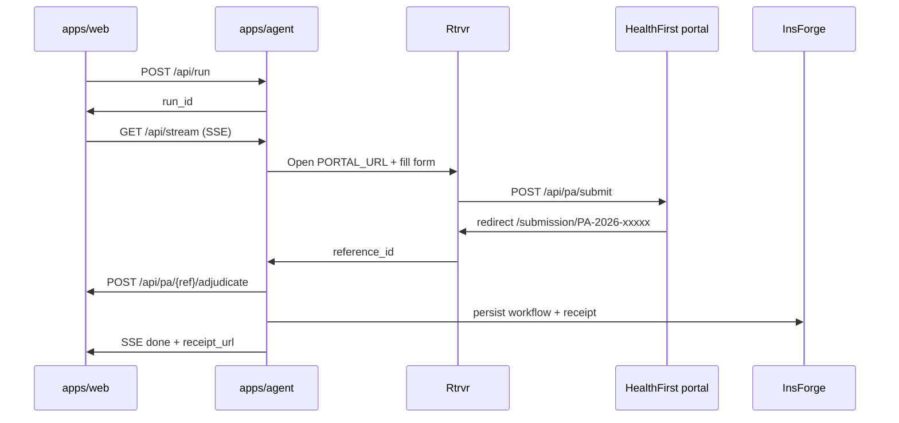

# HealthFirst mock portal — teammate handoff

Everything your teammate needs to wire **Rtrvr**, **FastAPI agent**, and sponsor tools on top of the mock insurer portal.

**Machine-readable spec:** [`mock/healthfirst-portal.json`](../mock/healthfirst-portal.json)  
**Demo patient fixture:** [`mock/healthfirst-case.json`](../mock/healthfirst-case.json)

---

## What is already built (you do NOT rebuild this)

| Layer | Owner | Location |
|-------|-------|----------|
| Mock HealthFirst UI (form + status pages) | You | `apps/web/src/app/portal/healthfirst/` |
| Form field IDs + submit button | You | `apps/web/src/components/portal/PriorAuthForm.tsx` |
| Submit + status + adjudicate APIs | You | `apps/web/src/app/api/pa/` |
| Demo run UI + SSE stream (simulated agent) | You | `apps/web/src/app/run/[id]/`, `apps/web/src/lib/agent-orchestrator.ts` |
| InsForge + Tigris wiring | You | `apps/web/src/lib/submissions.ts`, `docs/insforge.md` |

**Teammate builds:** `apps/agent/` — real FastAPI agent, Rtrvr browser automation, Daytona PDF extract, Opsera verify, InsForge persist from agent side.

---

## URLs (local dev)

Replace `{PORT}` with whatever `npm run dev` prints (often 3000, 3001, or 3002).

| Page | URL | Purpose |
|------|-----|---------|
| **PA form** | `http://localhost:{PORT}/portal/healthfirst/prior-auth` | Rtrvr opens this and fills the form |
| **Autofill demo** | `.../prior-auth?autofill=1&run={run_id}` | Built-in demo animation (replace with Rtrvr) |
| **Submission status** | `http://localhost:{PORT}/portal/healthfirst/submission/{ref}` | After submit — shows Pending → Under Review → Approved |
| **Success redirect** | `.../success?ref={ref}` | Redirects to submission status |
| **Main app** | `http://localhost:{PORT}/` | Upload PDFs, start run |
| **Agent audit** | `http://localhost:{PORT}/run/{run_id}` | SSE steps + embedded portal iframe |

**Env var for agent:**

```bash
WEB_URL=http://localhost:3000
PORTAL_URL=http://localhost:3000/portal/healthfirst/prior-auth
```

Use the **same port** as the running Next.js app. Do not hardcode 3000 if dev binds elsewhere.

---

## Form — field IDs (stable for Rtrvr)

These IDs are the contract. Do not rename without updating both sides.

| Field name | HTML `id` | CSS selector | Demo value (Sarah Martinez) |
|------------|-----------|--------------|----------------------------|
| Patient Name | `patient_name` | `#patient_name` | Sarah Martinez |
| Date of Birth | `dob` | `#dob` | 03/14/1986 |
| Member ID | `member_id` | `#member_id` | HF45821973 |
| Primary Diagnosis | `diagnosis` | `#diagnosis` | Type 2 Diabetes (E11.9) |
| Requested Medication | `medication` | `#medication` | Ozempic |
| Dosage / Frequency | `dosage` | `#dosage` | 0.25mg weekly |
| Prescribing Provider | `provider_name` | `#provider_name` | Emily Chen, MD |
| Clinical Justification | `justification` | `#justification` | Poor glycemic control despite first-line therapy. HbA1c 8.9% on Metformin x18mo. |

**Submit button:** `#submit-prior-auth` (text: "Submit Prior Authorization")  
**Form element:** `#prior-auth-form`  
**Form action:** `POST /api/pa/submit`

---

## Rtrvr task (copy-paste)

```
Open {PORTAL_URL}.

Fill these fields with the extracted patient data:
- #patient_name
- #dob
- #member_id
- #diagnosis
- #medication
- #dosage
- #provider_name
- #justification

Click #submit-prior-auth.

Wait until the browser URL matches /portal/healthfirst/submission/PA-*.

Return the reference_id from the URL (e.g. PA-2026-00451).
```

**Success signal:** redirect to `/portal/healthfirst/submission/{reference_id}`  
**Initial status after submit:** `pending_review` (NOT approved yet)

---

## API contract

Base: `{WEB_URL}` (same host as portal)

### 1. Start run

```http
POST /api/run
Content-Type: application/json

{ "demo": true }
```

Response:

```json
{ "run_id": "550e8400-e29b-41d4-a716-446655440000", "demo": true }
```

### 2. Stream agent steps (SSE)

```http
GET /api/stream/{run_id}
Accept: text/event-stream
```

Event types: `connected`, `step`, `portal`, `done`, `error`

Portal event (when agent should open browser):

```json
{
  "type": "portal",
  "path": "/portal/healthfirst/prior-auth?autofill=1&run=550e8400-..."
}
```

Full URL = `{WEB_URL}` + `path`

### 3. Submit prior auth (form or JSON)

**HTML form POST** (what Rtrvr does after clicking submit):

```http
POST /api/pa/submit
Content-Type: application/x-www-form-urlencoded
```

**JSON** (optional — for agent direct submit):

```http
POST /api/pa/submit
Content-Type: application/json

{
  "patient_name": "Sarah Martinez",
  "dob": "03/14/1986",
  "member_id": "HF45821973",
  "diagnosis": "Type 2 Diabetes (E11.9)",
  "medication": "Ozempic",
  "dosage": "0.25mg weekly",
  "provider_name": "Emily Chen, MD",
  "justification": "Poor glycemic control despite first-line therapy. HbA1c 8.9% on Metformin x18mo."
}
```

Response (JSON):

```json
{
  "reference_id": "PA-2026-00451",
  "status": "pending_review",
  "status_url": "http://localhost:3000/portal/healthfirst/submission/PA-2026-00451",
  "message": "Prior authorization request received. Status: Pending Review."
}
```

HTML form submit → `303` redirect to `status_url`.

### 4. Get submission status

```http
GET /api/pa/{reference_id}
```

### 5. Adjudicate (payer medical review)

**Agent must call this after submit.** Submit does NOT auto-approve.

```http
POST /api/pa/{reference_id}/adjudicate
Content-Type: application/json

{ "review_delay_ms": 8000 }
```

Status flow: `pending_review` → `under_review` (~8s) → `approved` or `denied`

Sarah Martinez + Ozempic + valid justification → **approved**  
Bad member ID or missing step therapy → **denied**

---

## End-to-end flow (teammate implements)

```
1. POST /api/run                    → run_id
2. GET  /api/stream/{run_id}        → listen for portal event
3. Rtrvr opens PORTAL_URL           → fill 8 fields → click submit
4. Capture reference_id from URL    → e.g. PA-2026-00451
5. POST /api/pa/{ref}/adjudicate    → trigger payer review
6. GET  /api/pa/{ref}               → poll until approved/denied
7. Persist to InsForge + Tigris     → receipt + agent_events
8. Return audit payload to /run UI
```



---

## Demo assets

| Asset | Path |
|-------|------|
| Patient chart PDF | `assets/demo/patient_chart_sarah_martinez.pdf` |
| Prescription PDF | `assets/demo/prescription_ozempic_martinez.pdf` |
| Public URLs (web) | `/demo/patient_chart_sarah_martinez.pdf`, `/demo/prescription_ozempic_martinez.pdf` |
| Fixture JSON | `mock/healthfirst-case.json` |
| TypeScript payload helper | `apps/web/src/lib/demo-case.ts` → `getDemoFormPayload()` |

---

## Env vars (teammate needs)

Copy from `.env.example` → `apps/agent/.env`:

```bash
WEB_URL=http://localhost:3000
PORTAL_URL=http://localhost:3000/portal/healthfirst/prior-auth
AGENT_URL=http://localhost:8000

RTRVR_API_KEY=
RTRVR_MODE=cloud

DAYTONA_API_KEY=
OPSERA_API_TOKEN=

INSFORGE_PROJECT_URL=https://z739c3mi.us-east.insforge.app
INSFORGE_API_KEY=

TIGRIS_ACCESS_KEY_ID=
TIGRIS_SECRET_ACCESS_KEY=
TIGRIS_ENDPOINT=https://t3.storage.dev
TIGRIS_BUCKET=authmatic-demo

DEMO_FIXTURE_MODE=true   # skip live Rtrvr, return canned receipt
```

See also: [docs/insforge.md](./insforge.md), [docs/tigris.md](./tigris.md)

---

## Quick smoke test (no agent)

```bash
cd apps/web && npm run dev
```

1. Open `http://localhost:PORT/portal/healthfirst/prior-auth` — form renders  
2. Open `...?autofill=1&run=test` — fields fill + submit  
3. Lands on `/portal/healthfirst/submission/PA-2026-xxxxx` — Pending Review  
4. `curl -X POST http://localhost:PORT/api/pa/PA-2026-xxxxx/adjudicate` — approve after ~8s  

Or from home: **Run demo — Sarah Martinez / Ozempic** → `/run/{id}` shows agent steps + portal iframe.

---

## What teammate replaces

| Current (demo/simulated) | Teammate (real) |
|--------------------------|-----------------|
| `agent-orchestrator.ts` simulated steps | FastAPI agent in `apps/agent/` |
| Client autofill `?autofill=1` | Rtrvr browser automation |
| In-process SSE in Next.js | Agent SSE from FastAPI (or proxy through web) |
| `DEMO_FIXTURE_MODE=true` fallback | Live PDF extract + live Rtrvr |

The **portal URLs, form IDs, and `/api/pa/*` endpoints stay the same** — that is the integration surface.
